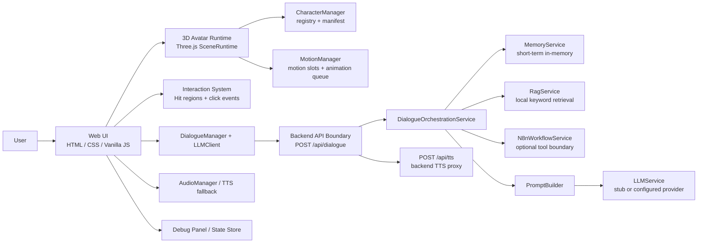

# AI Companion Alice

**AI 数字伙伴 / 互动数字人产品原型**

An interactive AI digital companion prototype with 3D avatar interaction, state-driven dialogue flow, backend API boundaries, and extensible Memory / RAG / workflow integration design.

Alice is not a plain chatbot UI. It explores how an AI companion can exist as an embodied, stateful, and interactive experience: users can switch avatars, click body regions, trigger motion feedback, send dialogue messages, hear TTS / browser fallback audio, and observe companion state through a debug panel.

This repository is currently a **local MVP / product prototype**, not a production SaaS. It intentionally keeps the default LLM provider as `stub`, so the full local demo can run without real API keys while still preserving a backend path for real providers.

## Demo Preview

> Demo screenshots / GIFs can be added here after the next UI polish pass.

## Highlights

- **Embodied AI interaction**: a Three.js avatar experience instead of a single text-only chatbot.
- **Replaceable avatar system**: Alice / Shiro / Wambo are loaded through avatar registry and manifest files.
- **Click-driven companion behavior**: head / body / arm / leg interactions map to reusable motion slots and fallback behavior.
- **State-driven architecture**: separates app state, avatar state, animation state, dialogue state, audio state, and interaction events.
- **Animation-ready runtime**: supports boot / idle / gesture / speaking / listening motion slots with queue and state-machine checks.
- **Unified AI backend boundary**: frontend dialogue flows through `/api/dialogue`, while `/api/chat` remains as a compatibility endpoint.
- **Local intelligence baseline**: supports stub provider, provider readiness, short-term Memory, local keyword RAG, optional n8n workflow boundary, and minimal Agent orchestration.
- **Security-aware evolution**: API keys, TTS keys, n8n webhook URL / secret, and future vector credentials stay behind the backend boundary.
- **Validation-first workflow**: includes regression, asset, config, API, security, Memory, RAG, workflow, Agent, and smoke checks.

## Architecture



Notes:

- `stub` is the default local demo provider.
- RAG is currently local keyword retrieval from `data/knowledge/`, not vector search.
- n8n is an optional backend tool boundary, not the main dialogue orchestrator.
- Qdrant / embedding / long-term memory database / multi-agent loops are future directions, not current completed features.

## Project Status

| Module | Status | Notes |
| --- | --- | --- |
| 3D Avatar Runtime | MVP | Three.js runtime with GLTF/VRM-style avatar loading path and scene lifecycle cleanup. |
| Avatar Switching | MVP | Alice / Shiro / Wambo are registered through `public/avatars/registry.json` and per-avatar manifests. |
| Interaction Events | MVP | Head / body / arm / leg interactions trigger configured motion slots or fallbacks. |
| Animation System | MVP / evolving | Motion slots, queue/state-machine checks, boot/idle/gesture/speaking/listening flows. |
| Dialogue Flow | MVP | Frontend main dialogue path uses `/api/dialogue`; `/api/chat` remains compatible. |
| TTS / Audio | MVP | Browser fallback plus backend TTS proxy boundary; real provider keys remain backend-only. |
| Backend API Boundary | MVP | Native Node HTTP backend with routes, services, provider readiness, upload validation, and security checks. |
| LLM Provider | MVP / configurable | Default `stub` provider works without keys; real providers require backend environment variables. |
| Short-term Memory | MVP | Backend in-memory session memory; not persistent and not a long-term profile database. |
| Local RAG | MVP | Local markdown / JSON keyword retrieval from `data/knowledge/`; no embeddings yet. |
| n8n Workflow | Boundary | Optional backend workflow invocation boundary; not a main orchestrator. |
| Agent Orchestration | MVP boundary | Minimal Memory -> RAG -> optional Workflow -> PromptBuilder -> LLM pipeline. |
| Deployment Security | Baseline | Pre-public checklist, optional API token boundary, security checks; not full production auth. |

## Quick Start

```bash
npm run dev
```

Open:

```text
http://localhost:3000
```

For debug state inspection:

```text
http://localhost:3000?debug=1
```

Default LLM provider is `stub`, so no API key is required for local demo. To use real OpenAI-compatible providers or cloud TTS, configure backend environment variables only. Do not put secrets in frontend code.

## Validation

Available scripts are defined in `package.json`:

```bash
npm run check
npm run smoke
npm run check:regression
npm run check:security-boundaries
npm run check:browser-capability
```

Recommended local baseline:

```bash
npm run check
npm run dev
npm run smoke
```

Then complete the browser checklist:

- [Browser Acceptance Checklist](./docs/process/BROWSER_ACCEPTANCE_CHECKLIST.md)

## Repository Structure

```text
.
├── backend/              # Native Node backend, API routes, provider boundaries, upload validation
├── css/                  # Frontend styling
├── data/knowledge/       # Local knowledge source for current keyword RAG prototype
├── docs/                 # Product, architecture, API, process, security and refactor docs
├── js/                   # Frontend ES modules: app, avatar, animation, dialogue, UI, state
├── public/avatars/       # Replaceable avatar registry and per-avatar manifests
├── public/models/        # Runtime model / animation assets
├── scripts/              # Checks, smoke tests and regression validation
├── archive/              # Historical files and source asset archive, not runtime code
└── index.html            # Browser entry with Three.js import map
```

## Product Thinking

Most AI product prototypes stop at a chat box. This project explores a different product question:

> What does an AI companion feel like when it has a body, visible state, motion feedback, voice, memory boundaries, and interaction beyond text input?

The current MVP focuses on the companion loop: avatar presence, user interaction, dialogue state, audio feedback, and safe backend integration boundaries. The goal is not to overbuild a production platform too early, but to keep the product direction tangible while gradually hardening the architecture.

## What This Project Demonstrates

This project demonstrates the ability to:

- Translate an AI companion concept into an interactive product prototype.
- Design frontend-backend boundaries for AI capability integration.
- Think beyond chatbot UI and explore embodied AI interaction.
- Structure a local MVP with acceptance criteria, API contracts, security notes, and regression scripts.
- Separate avatar loading, animation, interaction, dialogue, audio, state, and backend orchestration concerns.
- Use AI-assisted development while maintaining staged documentation, validation, and recovery points.

## Roadmap

### Current MVP / Baseline

- Three selectable avatars: Alice, Shiro, Wambo.
- Click interactions and motion-slot-driven feedback.
- `/api/dialogue` as the main dialogue entry.
- Local `stub` provider for no-key demos.
- Short-term backend Memory.
- Local keyword RAG from `data/knowledge/`.
- Optional n8n workflow boundary.
- Minimal Agent orchestration pipeline.
- Deployment security baseline and validation scripts.

### Next Phase

- Public-demo readiness: CORS whitelist, rate limiting, request logging, upload isolation, and stronger authentication.
- Better GitHub/demo presentation: screenshots, short GIF, project logo, and browser acceptance evidence.
- Product UI polish around dialogue state, source display, and debug visibility.

### Future Direction

- Real vector RAG with embedding and a vector database such as Qdrant.
- Persistent long-term memory with deletion and privacy controls.
- More robust avatar authoring and animation retargeting.
- Higher-quality TTS provider options and voice persona presets.
- Tool workflows through n8n as explicit backend tools, not frontend secrets.
- More expressive emotional / behavioral state models.

## Key Documents

- [Project Showcase](./docs/product/PROJECT_SHOWCASE.md)
- [Phase 3 Intelligence Baseline](./docs/product/PHASE3_BASELINE.md)
- [Phase 4 Deployment Security Baseline](./docs/security/PHASE4_DEPLOYMENT_SECURITY_BASELINE.md)
- [Architecture](./docs/architecture/ARCHITECTURE.md)
- [Dialogue Backend Boundary](./docs/architecture/DIALOGUE_BACKEND_BOUNDARY.md)
- [API Overview](./docs/api/API.md)
- [API Contract](./docs/api/API_CONTRACT.md)
- [Next Phase Plan](./docs/process/NEXT_PHASE_PLAN.md)

## Current Limitations

- This is a local prototype, not a deployed production service.
- The default AI response is local `stub` mode unless real backend provider keys are configured.
- Current RAG is local keyword retrieval, not embedding-based vector search.
- Current Memory is short-term process memory, not persistent long-term memory.
- Current auth is a lightweight private-demo boundary, not a full user system.
- No demo screenshots or GIFs are committed yet.
