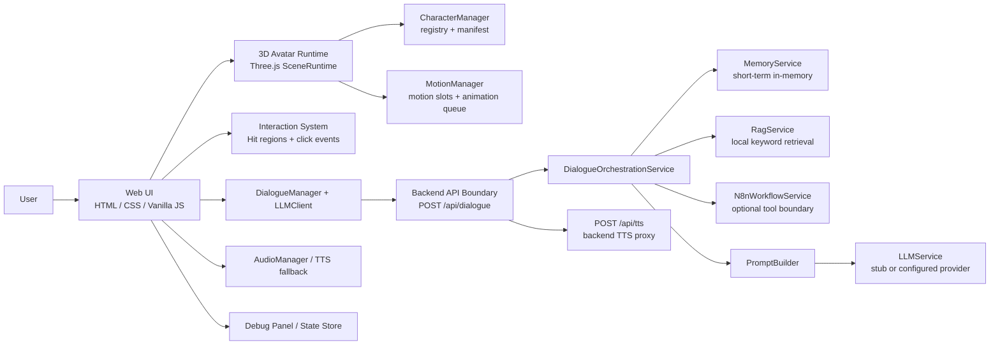

# AI Companion Alice

**语言**: [English](./README.md) | [简体中文](./README.zh-CN.md)

一个交互式 AI 数字伙伴项目，结合了 3D Avatar 交互、状态化对话流程、后端 API 边界，以及可扩展的 Memory / RAG / workflow 集成设计。

Alice 不是一个普通聊天框 Demo。这个项目探索的是：AI 伙伴如何以“具身化、状态化、可交互”的形式存在。用户可以切换角色、点击身体部位、触发动作反馈、发送对话、听到 TTS 或浏览器语音兜底，并通过 Debug Panel 观察当前状态。

当前仓库以 **本地 MVP 系统** 的方式组织，并保留了通向生产级 AI 伙伴系统的阶段化演进路径。项目默认使用 `stub` 作为本地 LLM provider，因此无需真实 API Key 也能跑通主要本地链路，同时保留了接入真实 provider 的清晰后端路径。

## 项目预览

> 后续 UI polish 之后，可以在这里补充项目截图或 GIF。

## 项目亮点

- **具身化 AI 交互**：基于 Three.js 的 3D 数字人体验，而不是纯文本聊天框。
- **可替换角色系统**：Alice / Shiro / Wambo 通过 avatar registry 与 manifest 加载。
- **点击式互动行为**：head / body / arm / leg 交互会映射到标准动作槽位或 fallback。
- **状态驱动架构**：拆分 app、avatar、animation、dialogue、audio、interaction 等状态。
- **面向动画扩展的运行时**：支持 boot / idle / gesture / speaking / listening 等动作槽位，并有队列与状态机检查。
- **统一 AI 后端边界**：前端对话流走 `/api/dialogue`，`/api/chat` 保留为兼容入口。
- **智能能力接入基线**：支持 stub provider、provider readiness、短期 Memory、本地关键词 RAG、可选 n8n workflow 边界和最小 Agent 编排。
- **安全边界清晰**：API Key、TTS Key、n8n webhook URL / secret、未来向量库凭据都留在后端。
- **验证优先的交付方式**：包含 regression、asset、config、API、安全、Memory、RAG、workflow、Agent 和 smoke 检查。

## 架构图



说明：

- `stub` 是默认本地开发 provider。
- 当前 RAG 是基于 `data/knowledge/` 的本地关键词检索，不是向量检索。
- n8n 当前是可选后端工具边界，不是主对话编排器。
- Qdrant / embedding / 长期记忆数据库 / 多 Agent 循环属于未来方向，不是当前已完成能力。

## 当前完成度

| 模块 | 状态 | 说明 |
| --- | --- | --- |
| 3D Avatar Runtime | MVP | Three.js runtime，支持 GLTF/VRM 风格角色加载路径和场景生命周期清理。 |
| Avatar Switching | MVP | Alice / Shiro / Wambo 通过 `public/avatars/registry.json` 和 per-avatar manifest 注册。 |
| Interaction Events | MVP | head / body / arm / leg 交互可触发动作槽位或 fallback。 |
| Animation System | MVP / evolving | motion slots、queue、state-machine checks、boot/idle/gesture/speaking/listening 流程。 |
| Dialogue Flow | MVP | 前端主对话路径使用 `/api/dialogue`，`/api/chat` 保留兼容。 |
| TTS / Audio | MVP | 浏览器语音兜底 + 后端 TTS proxy 边界，真实 provider Key 只在后端。 |
| Backend API Boundary | MVP | 原生 Node 后端，包含 routes、services、provider readiness、上传校验与安全检查。 |
| LLM Provider | MVP / configurable | 默认 `stub` 无 Key 可运行，真实 provider 需要后端环境变量。 |
| Short-term Memory | MVP | 后端进程内 session memory，不是长期用户画像数据库。 |
| Local RAG | MVP | 从 `data/knowledge/` 读取 markdown / JSON 并做关键词检索，没有 embedding。 |
| n8n Workflow | Boundary | 可选后端 workflow 调用边界，不是主编排器。 |
| Agent Orchestration | MVP boundary | 最小 Memory -> RAG -> optional Workflow -> PromptBuilder -> LLM pipeline。 |
| Deployment Security | Baseline | 单 token API 鉴权、CORS 白名单、请求 / 上传大小限制、轻量限流、requestId、结构化脱敏日志、上传隔离、deployment readiness 检查和配置文档。 |

## 快速启动

```bash
npm run dev
```

打开：

```text
http://localhost:3000
```

查看 Debug 状态：

```text
http://localhost:3000?debug=1
```

默认 LLM provider 是 `stub`，所以本地开发不需要 API Key。如果要使用真实 OpenAI-compatible provider 或云端 TTS，需要只在后端环境变量中配置 Key，不要把 secret 写入前端。

## 部署模式与 Secret 管理

当前项目把部署配置分成三种模式：

| 模式 | 使用场景 | 安全边界 |
| --- | --- | --- |
| `local` | 本地开发 | 允许 localhost 默认值，API auth 默认关闭，方便快速检查。 |
| `demo` | 受控私有演示 | 需要显式配置来源域名，建议开启单 token API auth。 |
| `production` | 公网部署候选 | 必须配置非 localhost-only 来源、API auth、非占位 token、rate limit 和明确的上传 / 公开资源目录。 |

真实 API Key、provider token、n8n webhook、TTS key、未来向量库凭证、`.env`、`.env.local`、日志和上传隔离目录都不应该提交到仓库。它们只应该存在于本地未提交配置或部署平台的 Environment Variables / Secret Manager。

这仍然不是完整生产级安全系统：当前不包含用户登录、OAuth/RBAC、WAF、对象存储、CDN 隔离、病毒扫描、沙箱解析、外部链路追踪或多实例限流。

部署资料：

- [Environment Modes](./docs/deployment/ENVIRONMENT_MODES.md)
- [Deployment Checklist](./docs/deployment/DEPLOYMENT_CHECKLIST.md)
- [Phase 4 Deployment Security Baseline](./docs/security/PHASE4_DEPLOYMENT_SECURITY_BASELINE.md)

## 验证命令

所有脚本以 `package.json` 为准：

```bash
npm run check
npm run smoke
npm run check:regression
npm run check:security-boundaries
npm run check:deployment-readiness
npm run check:browser-capability
```

我通常用这组命令做本地基线验收：

```bash
npm run check
npm run dev
npm run smoke
```

然后按浏览器清单手动验收：

- [Browser Acceptance Checklist](./docs/process/BROWSER_ACCEPTANCE_CHECKLIST.md)

## 仓库结构

```text
.
├── backend/              # 原生 Node 后端、API routes、provider 边界、上传校验
├── css/                  # 前端样式
├── data/knowledge/       # 当前本地关键词 RAG 的知识源目录
├── docs/                 # 产品、架构、API、流程、安全和重构文档
├── js/                   # 前端 ES Modules：app、avatar、animation、dialogue、UI、state
├── public/avatars/       # 可替换角色 registry 和 per-avatar manifests
├── public/models/        # 运行时模型 / 动画资源
├── scripts/              # 检查、smoke test 和回归验证脚本
├── archive/              # 历史文件和源素材归档，不是运行时代码
└── index.html            # 浏览器入口，使用 Three.js import map
```

## 产品思考

很多 AI 产品仍然从聊天框开始。这个项目探索的是另一个问题：

> 当 AI 伙伴拥有身体、可见状态、动作反馈、声音、记忆边界，以及文本之外的互动方式时，体验会有什么不同？

当前 MVP 聚焦的是 AI 伙伴的基础循环：角色存在感、用户交互、对话状态、音频反馈和安全的后端集成边界。整体工程策略是分阶段推进：先证明具身交互体验，再逐步强化智能能力、安全边界、部署能力和产品体验，而不是一开始就把所有能力堆成一次性大重构。

## 我重点做了什么

这个项目里，我重点做了：

- 把 AI companion 概念转化成可运行的交互系统。
- 为 AI 能力接入设计清晰的前后端边界。
- 跳出传统 chatbot UI，探索具身化 AI 交互。
- 用验收标准、API 合约、安全文档和回归脚本管理 MVP。
- 拆分 avatar loading、animation、interaction、dialogue、audio、state 和 backend orchestration。
- 在使用 AI 辅助开发的同时，保留阶段化交付、文档基线和可恢复节点。

## 路线图

### 当前 Baseline

- 三个可切换角色：Alice、Shiro、Wambo。
- 点击交互和 motion-slot 动作反馈。
- `/api/dialogue` 作为主对话入口。
- 本地 `stub` provider 支持无 Key 开发。
- 后端短期 Memory。
- 来自 `data/knowledge/` 的本地关键词 RAG。
- 可选 n8n workflow 边界。
- 最小 Agent orchestration pipeline。
- 部署安全基线：单 token API auth、CORS 白名单、请求 / 上传限制、轻量限流、requestId、结构化脱敏日志、上传隔离、deployment readiness checks。

### 我下一步会重点做：AI 能力主线

- 我会把下一阶段重新切回 AI 数字伙伴核心：记忆系统架构、角色人格、陪伴连续性，以及语音 / 动作状态反馈。
- Phase 4 的安全基线会作为后续部署护栏保留，不再继续把安全工作过度扩大到完整生产系统。
- 我会补项目展示材料：截图、短 GIF、简单 Logo，以及浏览器验收记录。
- 我会继续打磨产品体验，重点放在对话状态、知识来源展示和 Debug 可视化上。

### 更长期的方向

- 先设计记忆系统，再用 SQLite 做本地 sessions、memory turns、agent events 和 user settings 持久化。
- 计划使用 `data/sqlite/alice.db` 作为本地记忆主库；SQLite 当前尚未接入。
- 把短期 Memory 升级成可清除、可隔离、重视隐私的长期记忆摘要。
- 为 Alice / Shiro / Wambo 建立 persona 配置，让角色差异不只是模型不同。
- 优先优化中文陪伴对话连续性，再扩展知识库能力。
- RAG / Qdrant / embedding 保留为可选增强，不作为近期主线。
- 将 n8n 作为受控后端工具能力接入具体任务，而不是主对话大脑。
- 继续完善角色编辑、模型替换和动画重定向能力。
- 增加更高质量的 TTS provider 和声音人格预设。
- 在核心链路稳定之后，再探索更丰富的情绪和行为状态模型。

## 关键文档

- [Project Showcase](./docs/product/PROJECT_SHOWCASE.md)
- [Phase 3 Intelligence Baseline](./docs/product/PHASE3_BASELINE.md)
- [Phase 4 Deployment Security Baseline](./docs/security/PHASE4_DEPLOYMENT_SECURITY_BASELINE.md)
- [Phase 5 Memory Architecture](./docs/architecture/PHASE5_MEMORY_ARCHITECTURE.md)
- [Phase 5 Companion Experience](./docs/product/PHASE5_COMPANION_EXPERIENCE.md)
- [Environment Modes](./docs/deployment/ENVIRONMENT_MODES.md)
- [Deployment Checklist](./docs/deployment/DEPLOYMENT_CHECKLIST.md)
- [Architecture](./docs/architecture/ARCHITECTURE.md)
- [Dialogue Backend Boundary](./docs/architecture/DIALOGUE_BACKEND_BOUNDARY.md)
- [API Overview](./docs/api/API.md)
- [API Contract](./docs/api/API_CONTRACT.md)
- [Next Phase Plan](./docs/process/NEXT_PHASE_PLAN.md)
