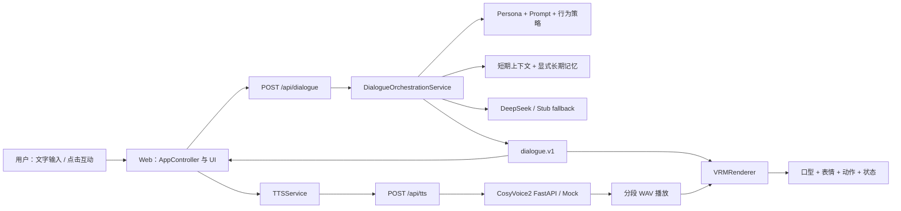

# Alice 项目全面审核与价值评估

日期：2026-08-03  
范围：产品价值、Web / Backend / Dialogue / Memory / TTS / VRM 架构、现有验收证据与未来一个月路线  
性质：审计与路线决策，不是新功能设计文档

## 一句话判断

**Alice 已是工程闭环完整、可以重复验收的本地可测试 MVP，也是有说服力的作品集项目；但它还不是被真实用户需求、复访行为和相对基线优势验证过的成立产品。**

当前最重要的工作不是继续增加模型、Provider、动作或“长期关系”功能，而是把开发者 Demo 收敛成一个一致、可分发、可自行开始的 Alice 体验，然后用 10 名目标用户和 7 天实际复访验证消费级数字伙伴假设。

> 2026-08-03 后续进展：本报告提出的第一个 P0 已完成代码收口。普通入口现提供一次点击开始、默认关闭的记忆同意和持续可访问的隐私入口；开发设置、Debug 和进阶控件仅在显式 QA 入口出现。产品价值判断仍未改变，下一门槛是陌生用户的 60 秒自行开始、10 分钟会话与 7 天实际复访。

## 1. 审计方法与证据边界

本报告按以下优先级判断事实：

1. 当前源码和自动检查；
2. 当前契约与权威文档；
3. 2026-07-24 至 2026-07-31 的真实模型、真实语音和浏览器验收报告；
4. 历史阶段文档，仅用于解释决策背景。

主要证据入口：

- 当前阶段与风险：[CURRENT_STATUS.md](../project-memory/CURRENT_STATUS.md)、[RISKS_AND_TODO.md](../project-memory/RISKS_AND_TODO.md)
- 对话与 API 边界：[DIALOGUE_CONTRACT.md](../contracts/DIALOGUE_CONTRACT.md)、[API_CONTRACT.md](../api/API_CONTRACT.md)
- 系统与状态边界：[ARCHITECTURE.md](../architecture/ARCHITECTURE.md)、[STATE_MODEL.md](../architecture/STATE_MODEL.md)
- 10 轮真实体验：[DEMO_EXPERIENCE_ACCEPTANCE_20260724.md](./DEMO_EXPERIENCE_ACCEPTANCE_20260724.md)
- 12 轮行为微调：[DIALOGUE_BEHAVIOR_TUNING_20260727.md](./DIALOGUE_BEHAVIOR_TUNING_20260727.md)
- 连续语音与首音数据：[P5_CONTINUOUS_TTS_DECISION_20260728.md](./P5_CONTINUOUS_TTS_DECISION_20260728.md)、[TTS_FOLLOWUP_AUDIT_20260731.md](./TTS_FOLLOWUP_AUDIT_20260731.md)
- VRM 与表现层：[VRM_RENDERER_MVP.md](../architecture/VRM_RENDERER_MVP.md)、[AVATAR_PRESENTATION_CONTRACT.md](../avatar/AVATAR_PRESENTATION_CONTRACT.md)
- 部署与安全：[ENVIRONMENT_MODES.md](../deployment/ENVIRONMENT_MODES.md)、[PHASE4_DEPLOYMENT_SECURITY_BASELINE.md](../security/PHASE4_DEPLOYMENT_SECURITY_BASELINE.md)

本报告没有可引用的陌生用户研究、留存、转化或付费数据。因此，“目标人群”“持续使用动机”“各模块用户价值”都是基于现状的**待验证审计判断**，不能写成已经成立的市场事实。已有 DeepSeek、CosyVoice2 和浏览器验收证明链路能工作，不等于用户愿意持续使用。

本轮没有再次调用真实 DeepSeek 或 CosyVoice2，不产生新的模型费用。文末记录本轮零费用检查结果。

## 2. 当前架构和能力地图

### 2.1 已经真实可用的能力

| 能力 | 当前实现 | 审计结论 |
| --- | --- | --- |
| 中文真实对话 | `/api/dialogue` 通过后端调用 DeepSeek；失败可受控降级 Stub | 10 轮 Demo 与 12 轮行为集均有真实结果，可用于受控测试 |
| Persona 与行为约束 | 后端持有 Alice Persona、Prompt 分层和即时行为优先级 | “先别给建议”等固定边界已回归，但尚未经过陌生用户自由表达验证 |
| 对话连续性 | 最近 6 轮短期上下文按 session + avatar 隔离 | 能承接同一会话；未证明 10 分钟后的主观关系感 |
| 可控记忆 | 显式偏好写入、敏感内容阻断、SQLite 持久化 | 技术有效且边界保守；新浏览器默认未开启，跨日价值未验证 |
| 真实语音 | 后端连接本地 CosyVoice2 官方 FastAPI，失败可回 Mock | 连续播放稳定；中长文本首音仍约 10–13 秒 |
| 具身表现 | `dialogue.v1` 输出 emotion、tone、AvatarDirective，VRM 负责表情、口型和动作 | `girl.vrm` 的保守口型和生命周期已实测；声音情绪联动尚未真正兑现 |
| 可观测性 | requestId、provider/model/mode、LLM/编排耗时、fallback 和错误码 | 足够支撑下一轮本地产品测试与排障 |
| 本地运行与降级 | `demo:start/status/stop`，Stub/Mock 零费用回归，真实服务 readiness | 本机体验闭环完整；仍不是可交给远程用户的成品分发方式 |

这些边界由 [DialogueOrchestrationService.js](../../backend/services/DialogueOrchestrationService.js)、[MemoryService.js](../../backend/services/MemoryService.js)、[CosyVoiceTTSProvider.js](../../backend/services/tts/providers/CosyVoiceTTSProvider.js)、[TTSService.js](../../js/voice/TTSService.js) 和 [VRMRenderer.js](../../js/avatar/renderers/VRMRenderer.js) 实现。

### 2.2 已完成技术实现、但尚未形成用户价值的能力

- 多 LLM Provider adapter 已存在，但只有当前 DeepSeek 主线有最近真实验收。更多 adapter 提升的是可替换性，不是用户选择 Alice 的理由。
- emotion、tone、prosody 和 AvatarDirective 已形成语义链路；但当前 CosyVoice SFT 请求只发送 `tts_text` 与 `spk_id`，没有消费语气和韵律指令。因此“语音情绪联动”目前主要是架构准备，而不是经听感证实的产品价值，见 [CosyVoiceTTSProvider.js](../../backend/services/tts/providers/CosyVoiceTTSProvider.js) 和 [TTSVoicePolicy.js](../../backend/services/tts/TTSVoicePolicy.js)。
- 动作队列、状态和 retarget QA 边界较完整，但“更多动作”没有对应的用户任务；现有动作资产仍需逐个做兼容性与授权检查，见 [VRM_MOTION_READINESS.md](../architecture/VRM_MOTION_READINESS.md)。
- RAG、n8n、Agent 等后端扩展边界存在，不代表当前低压力陪伴场景需要这些能力。
- 上传 Avatar、Provider 设置、Debug、录制、分享、服装和亲密度等界面元素让技术能力可见，但部分是开发入口或占位项，尚未组成清晰的用户体验。

### 2.3 尚未成立的核心产品假设

- 目标用户会在工作或学习后，主动选择 Alice 进行 5–10 分钟低压力中文交流。
- “不急着建议、不连续追问、记得我说过的话”比通用语音助手更能驱动复访。
- Avatar 不只带来第一次的新鲜感，还能提升 7 天内的再次使用。
- 用户愿意为当前等待时长、启动方式和 3D 资源成本付出耐心。
- 显式记忆在隐私感和关系感之间达到合适平衡。
- 用户能描述出一致的 Alice 人格，而不是只感受到“回答比较温柔”。

## 3. 产品阶段判断

### 3.1 阶段定义

Alice 的**核心链路**已经超过技术原型：真实 LLM、真实 TTS、记忆、Avatar 表现、fallback、诊断和自动检查能够一起工作，因此可以称为“本地可测试 MVP”。

Alice 的**整体产品表面**仍是产品原型 / 开发者 Demo，而不是接近可发布产品：

- 首次模型加载后显示并朗读“模型装载完毕，交互系统已激活”，见 [AppController.js](../../js/app/AppController.js)。
- 点击台词仍混有“指挥官、机体、装甲、战斗准备”等设定，见 [dialogues.js](../../js/config/dialogues.js)；这与 [avatarPersonas.js](../../backend/config/avatarPersonas.js) 中温暖、日常、轻盈的 Alice 不一致。
- [index.html](../../index.html) 同时暴露 Provider、模型、system prompt、Avatar 上传、渲染与 Debug 控件，也保留服装、亲密度、录制和分享等未形成闭环的入口。
- 真实默认可在本机 readiness 后切到 DeepSeek 与 CosyVoice2，但运行仍依赖本机配置和外部 TTS runtime。

因此当前准确表述是：**工程 MVP 已成立，产品假设尚未成立，公开发布条件尚未成立。**

### 3.2 当前真正要解决的用户问题

首要验证人群不是所有“喜欢二次元或 AI”的用户，而是：

> 工作或学习结束后，希望用 5–10 分钟说说近况、获得低压力回应的中文年轻用户。

首要问题假设是：

> 用户想表达、被承接、偶尔被记住，但不希望每次都被建议、追问、教育或强行积极。

这是 Alice 当前 Persona、行为策略、短期上下文和具身表达能共同服务的最窄场景。Alice 现在不应定位为心理治疗工具、效率助手、游戏平台或通用 AI 助手：这些方向会立即引入更高的正确性、安全性、工具能力或内容规模要求，也会稀释已经形成的“轻陪伴”闭环。

### 3.3 用户为什么可能持续使用

可能成立的复访动机只有三项：

1. **交流负担低**：不要求用户组织任务，不急着解决问题。
2. **角色连续**：同样的 Alice 能承接前文，并在用户同意时记住少量稳定偏好。
3. **具身仪式感**：声音、Avatar、口型和轻动作让“聊几分钟”与普通文本输入不同。

其中任何一项都还没有复访数据支持。反过来，Provider 数量、动作数量、情绪状态数量和技术面板丰富度不会天然产生复访。

## 4. 已经成立的价值与尚未成立的价值

### 4.1 已经成立

- **完整工程闭环价值：高。** 从输入、Prompt、真实模型、记忆、语音，到 VRM 表现和 fallback 都有清晰边界及自动检查；这对作品集、技术演示和后续实验很有价值。
- **中文即时行为控制价值：中高。** 12 个固定真实 DeepSeek 用例证明“当前轮要求高于默认主动帮助”可以稳定执行，见 [DIALOGUE_BEHAVIOR_TUNING_20260727.md](./DIALOGUE_BEHAVIOR_TUNING_20260727.md)。
- **本地具身 Demo 价值：中高。** `girl.vrm`、真实音频、保守不露齿口型、表情和状态生命周期已完成 99.48 秒音频与连续对话验收，见 [DEMO_EXPERIENCE_ACCEPTANCE_20260724.md](./DEMO_EXPERIENCE_ACCEPTANCE_20260724.md)。
- **可回归和可诊断价值：高。** 当前测试覆盖契约、Provider、Memory、TTS、VRM、行为与部署 readiness，能较安全地做小步产品实验。

### 4.2 尚未成立

- 没有证据证明 Alice 比普通文本聊天或成熟语音助手更能让用户持续交流。
- 没有证据证明 Avatar 对复访的贡献高于加载、渲染和资产分发成本。
- 没有证据证明当前记忆策略能产生跨日关系感；现有验收只证明一条显式偏好能被正确保存和召回。
- 没有证据证明用户接受 10–13 秒的中长回复首音等待。
- 没有证据证明用户愿意配置或理解当前开发者式入口。
- 没有商业化、内容增长或获客证据。

## 5. Persona、Memory、声音和 Avatar 的价值贡献

下表是审计判断，不是用户研究数据。

| 要素 | 当前贡献 | 已有证据 | 主要缺口 |
| --- | --- | --- | --- |
| Persona / 对话策略 | 高 | 10 轮真实会话、12 轮指令服从与上下文用例 | 人格仍偏“温柔助手”通用风格；陌生用户能否形成一致描述未知 |
| 会话内上下文 | 中高 | 最近对话能承接，“其实这几天一直这样”等固定用例通过 | 是否让用户主观感到关系连续尚未验证 |
| Memory | 中 | 显式偏好可保存、召回、隔离，敏感内容不写入 | 新浏览器默认关闭；跨日复访和记忆惊喜感未验证 |
| 声音 | 中 | CosyVoice2 长音频、连续分段、fallback 和口型生命周期稳定 | 中长回复首音 10–13 秒；当前 SFT 没有消费 emotion/tone/prosody |
| Avatar / 口型 | 中 | `girl.vrm`、保守口型、不露齿和表情收口已有视觉验收 | 价值可能主要来自新鲜感；资产授权、分发和其他模型 QA 未解决 |
| 更多动作 / 状态 | 低 | 架构和 QA 工具存在 | 没有用户问题证明动作数量是瓶颈，且容易进入无止境打磨 |

最可能产生“这是 Alice，而不是套壳聊天机器人”的组合不是更大模型，而是：**稳定的说话分寸 + 对刚才内容的自然承接 + 用户同意下的一次准确记忆 + 不冲突的声音和轻量具身表现。**

## 6. 相对产品位置与可能差异化

这里只比较官方公开的能力表面，不将厂商介绍当作留存证据，也不推断未公开的产品数据。

| 产品 | 官方公开能力 | Alice 不应硬碰的部分 | Alice 可验证的窄差异 |
| --- | --- | --- | --- |
| ChatGPT Voice | 实时语音可被打断，并可结合记忆、搜索、文字与图像；官方也提供 Personality 和 Memory 设置 | 通用智能、实时交互、跨模态、生态与稳定性 | 单一中文角色、克制陪伴行为、显式可控记忆、可自托管的具身体验 |
| Character.AI | Character Calls 提供双向、多语言角色语音；平台拥有角色生态，并持续扩展角色记忆能力 | 角色数量、内容生态、社区与创作者规模 | 不做角色市场，只把一个 Alice 的中文一致性和隐私边界做清楚 |
| Grok Companion | xAI 官方将 Companion 作为 Grok 消费端能力；FAQ 当前说明 Companion 主要在 iOS | 品牌角色、移动端分发和产品资源 | Web 本地可运行、可控技术栈和更窄的低压力中文交流场景 |

官方来源（访问时间 2026-08-03）：[ChatGPT Voice](https://help.openai.com/en/articles/20001274/)、[ChatGPT Memory FAQ](https://help.openai.com/en/articles/8590148-memory-faq)、[ChatGPT Personality](https://help.openai.com/en/articles/11899719-customizing-your-chatgpt-personality)、[Character Calls FAQ](https://support.character.ai/hc/en-us/articles/23957274129691-Character-Calls-Voice-FAQ)、[Character.AI Memory](https://blog.character.ai/memory/)、[xAI Grok Overview](https://docs.x.ai/grok/overview)、[xAI Grok FAQ](https://docs.x.ai/grok/faq)。

Alice 目前没有可防御的功能壁垒。唯一值得验证的差异是：**一个而不是一万个角色；以中文日常陪伴为主；记忆和隐私边界可解释；Avatar、声音和对话围绕同一人格而不是各自展示技术。** 如果用户感知不到这项组合差异，继续堆能力不会形成产品。

## 7. 技术架构评估

### 7.1 足以支撑下一阶段的部分

- **职责边界合理。** Web 负责 UI、音频播放和表现层；Node Backend 负责 Dialogue、Memory、Provider 与 secret；CosyVoice2 作为独立 runtime。这一边界适合本地 MVP 和小规模私有测试，见 [ARCHITECTURE.md](../architecture/ARCHITECTURE.md)。
- **`dialogue.v1` 足够。** `reply_text`、companion state、emotion、tone、avatar directive、memory event、TTS 和兼容 meta 已覆盖下一轮产品验证；不需要为了 streaming 或新 Provider 改写现有同步消费方式，见 [DIALOGUE_CONTRACT.md](../contracts/DIALOGUE_CONTRACT.md)。
- **Provider 架构已经足量。** DeepSeek / Stub 和 CosyVoice2 / Mock 能覆盖真实体验及降级测试。现阶段新增 Provider 只增加凭据、错误语义、音色和运维矩阵。
- **诊断能力足量。** requestId、LLM/编排耗时、TTS 分段指标、状态快照和专项检查足够定位下一轮高频问题。
- **表现层边界正确。** 业务层输出语义，Renderer 决定 VRM 表情和口型，没有把骨骼或 morph 名称泄漏进对话契约。

### 7.2 真正阻碍产品验证的问题

1. **Demo 表面不一致。** 开发文案、机甲点击台词、技术设置和占位控件共同削弱 Persona；这是用户会直接看到的问题。
2. **首音等待明显。** P5 已把浏览器连续播放最大 gap 从 `6271ms` 降至 `236ms`，但 54 字首播 p50 / p90 仍为 `12.010s / 15.337s`，见 [TTS_FOLLOWUP_AUDIT_20260731.md](./TTS_FOLLOWUP_AUDIT_20260731.md)。当前瓶颈是推理吞吐和首段准备，不是播放器间隙。
3. **模型资产不能安全分发。** `alice` manifest 指向 `assets/avatars/test-vrm/girl.vrm`，而 `.gitignore` 排除该 VRM；当前机器可用不等于新环境可用。公开或商业分发前还必须确认模型授权，见 [alice manifest](../../public/avatars/alice/manifest.json) 与 [.gitignore](../../.gitignore)。
4. **私有部署鉴权闭环未形成。** 后端支持并在 production 强制单 token API auth，但 [ApiClient.js](../../js/services/api/ApiClient.js) 没有面向最终用户的 token 获取或会话认证流程。不能把共享 secret 放进前端；远程测试应优先使用整站访问网关或实现合适的用户会话鉴权，而不是硬编码 `API_AUTH_TOKEN`。
5. **Memory 入口与产品承诺不一致。** [LocalConfigStore.js](../../js/storage/LocalConfigStore.js) 中 `useMemory` 对新浏览器默认为 false；[demoExperience.js](../../js/config/demoExperience.js) 的 ready 默认只切换 LLM 和 TTS。因此 10 轮验收中的记忆证明实现正确，但不代表陌生用户默认能体验“她记得我”。

### 7.3 可以继续容忍的技术债

- [AppController.js](../../js/app/AppController.js)、[TTSService.js](../../js/voice/TTSService.js)、[DialogueOrchestrationService.js](../../backend/services/DialogueOrchestrationService.js) 体积较大，未来可能降低修改效率，但当前专项测试覆盖较强，尚未阻止产品验证。
- [STATE_MODEL.md](../architecture/STATE_MODEL.md) 记录了分层状态与 legacy flat fields 并存。它增加理解成本，但没有证据表明需要现在重写状态系统。
- [DialogueBehaviorPolicy.js](../../backend/services/DialogueBehaviorPolicy.js) 依赖正则检查和受控重写，对固定场景有效，但继续枚举规则容易膨胀并增加边界轮次延迟。下一条规则只应来自真实用户的高频失败。
- 多 TTS adapter、动作 QA 工具和 Renderer 兼容层存在一定超前设计，但只要不继续扩大公开支持面，可以保留而无需清理。
- 当前没有 GitHub CI。对单人本地实验尚可容忍；开始远程协作或公开发布时再将现有零费用检查接入 CI。

### 7.4 性能、安全和维护成本

- LLM 实测通常可用，但复杂行为边界可能触发多次生成，已有单轮约 `17.08s` 的最慢记录。不能用更多规则重写替代用户测试。
- CosyVoice2 在当前 CPU 环境连续性已稳定，但 runtime、模型权重、缓存和约 5 分钟冷启动等待提高了演示准备成本。
- Three.js / VRM 依赖当前由 CDN 提供，离线或受限网络环境存在加载风险。
- 后端已有 CORS、单 token auth、请求大小、rate limit、上传隔离、日志脱敏和 requestId；它们是可靠基线，但不是多用户账号、对象存储、WAF、集中日志或多实例部署。
- Web 与 iOS 复用应停留在 HTTP 契约、Persona / Memory / Provider 后端语义；不要为了未来 iOS 提前抽象 Web Renderer 或重写现有表现层。

## 8. 投入价值与优先级

评分是审计判断：用户价值、验证价值越高越好；成本、风险越高越不利。统一使用 1（低）到 5（高）。

优先级含义：

- **P0：不做就无法验证产品。**
- **P1：能够显著增强核心体验，但应由验证证据触发。**
- **P2：产品成立后再做。**
- **停止或暂缓：当前投入价值低，或容易形成无止境优化。**

| 方向 | 用户价值 | 验证价值 | 成本 | 风险 | 前置条件 | 建议 |
| --- | ---: | ---: | ---: | ---: | --- | --- |
| 单一 Alice Demo 表面 | 5 | 5 | 2 | 1 | 只保留已工作的能力 | **P0**：去技术术语、占位控件和冲突台词，用户可自行开始 |
| 部署和分享 | 5 | 5 | 3 | 4 | girl 资产授权/分发；整站访问控制；HTTPS | **P0**：先支持受控测试，不追求完整生产平台 |
| 用户测试与评估体系 | 5 | 5 | 2 | 2 | 单一入口、招募标准和记录模板 | **P0**：10 人、10 分钟、7 天实际复访 |
| 对话人格与指令服从 | 5 | 4 | 2 | 2 | 真实自由表达失败样本 | **P1**：保留现状，只修高频失败，不继续凭想象加规则 |
| 会话内关系感 | 5 | 4 | 2 | 2 | 短期上下文已稳定 | **P1**：测承接、少重复、角色一致；不做关系等级 |
| TTS 首音体验 | 4 | 4 | 3 | 3 | 先记录用户是否真正投诉 | **P1 条件项**：投诉率超过 30% 才做一次候选对照 |
| 更换或增加 TTS 模型 | 3 | 4 | 4 | 4 | 首音确认为主要流失原因；有有效凭据 | **P1 条件项**：只对照一个候选，不开放 Provider 市场 |
| 长期记忆 | 4 | 3 | 4 | 4 | 先验证显式记忆是否被需要和信任 | **P2**：跨日价值成立后再扩；当前不做自动关系记忆 |
| 语音输入与实时对话 | 4 | 3 | 5 | 5 | 基础复访成立；打断、VAD、权限与流式协议 | **P2**：不是当前产品验证前提 |
| Avatar 模型质量 | 3 | 2 | 3 | 3 | 用户确认愿意保留 Avatar；授权明确 | **P2**：先解决分发，不先换更贵模型 |
| VRM 动作和自然表现 | 2 | 2 | 4 | 4 | 真实用户明确认为僵硬阻碍交流 | **停止或暂缓**：保持现有保守口型和轻动作 |
| 主动交互 | 3 | 2 | 4 | 5 | 复访、通知同意、打扰边界 | **P2**：当前不主动打扰用户 |
| 情绪状态机 | 2 | 1 | 4 | 4 | 现有情绪误判数据表明必须修改 | **停止或暂缓**：当前语义 + 表现映射够用 |
| 关系成长系统 | 3 | 2 | 5 | 5 | 长期复访与记忆价值先成立 | **停止或暂缓**：不要用等级模拟尚未存在的关系 |
| 游戏伙伴方向 | 2 | 2 | 5 | 5 | 独立用户需求、游戏集成和内容策略 | **停止或暂缓**：与当前低压力交流主线冲突 |
| iOS | 4 | 2 | 5 | 4 | Web 产品信号、移动场景和分发策略 | **停止或暂缓**：复用契约即可，不开始双端维护 |
| PCM streaming | 3 | 2 | 5 | 5 | provider 生成实时系数显著小于 1 | **停止或暂缓**：当前 CPU chunk gap 超过 2 秒，已被实测否决 |
| RAG | 2 | 1 | 4 | 4 | 用户任务确实需要外部知识 | **停止或暂缓**：陪伴场景没有知识检索瓶颈 |
| Agent / 工具调用 | 2 | 1 | 5 | 5 | 明确效率任务和权限模型 | **停止或暂缓**：会把产品带向通用助手 |
| 多模型 Provider | 1 | 1 | 3 | 4 | 当前 Provider 可靠性成为阻碍 | **停止或暂缓**：DeepSeek + Stub 足够验证 |
| 商业化和内容运营 | 3 | 2 | 4 | 4 | 留存和目标场景先成立 | **P2**：先验证复访，不先做订阅、皮肤或内容供给 |

## 9. 停止、保留、优化和新增

| 决策 | 内容 | 约束 |
| --- | --- | --- |
| 保留 | DeepSeek 主线、Stub fallback、CosyVoice2、Mock fallback、保守不露齿口型、`dialogue.v1`、显式记忆、现有诊断和测试 | 作为稳定实验底座，不重构、不扩大公开 Provider |
| 优化 | 单一 Alice 体验、记忆同意入口、Persona 与点击/系统文案一致性、首音数据记录、可分发私有 Demo | 只修直接阻碍用户测试的问题 |
| 新增 | 目标用户招募标准、10 分钟测试协议、逐轮问题记录、基线对照、7 天复访记录 | 新增的是验证机制，不是产品功能 |
| 停止或暂缓 | PCM streaming、更多动作、复杂情绪状态机、自动长期记忆、关系等级、主动打扰、RAG、Agent、多 Provider、游戏伙伴、iOS、商业化系统 | 至少等消费级产品信号达到文末门槛 |

沉没成本不构成继续投入理由。已有 Provider adapter、动作系统、RAG 边界和移动端交接资料可以保留，但不应为了“已经做了不少”继续把它们产品化。

## 10. 接下来一个月：最多三项工作

### 第 1 周：P0，收敛一个可自行开始的 Alice 测试入口

目标不是重新设计 UI，而是让陌生用户只看到一致且已工作的核心体验：

- 默认进入 girl / DeepSeek / CosyVoice2 的 ready 主线；服务未 ready 时给人类可理解的状态，不展示 Stub、Mock 或 Provider 术语。
- 移除或隐藏首次系统装载文案、机甲设定台词、未实现服装/亲密度/录制/分享和非测试必需的上传、Provider、Debug 控件。
- 在首次使用前用一句话解释记忆开关和保存范围，让用户主动同意；不要默认宣称 Alice 会记住用户。
- 本地招募可先用同一台机器；若需要远程测试，先解决 girl.vrm 授权与可发布路径，并使用整站访问网关或用户会话鉴权，禁止把共享 API secret 放在前端。

可验证目标：

- 5/5 预试用户无需开发者讲解，在 60 秒内开始第一轮真实对话。
- 正常入口没有可点击但不工作的控件，没有“系统、模型、Provider、Stub、Mock、机体、指挥官”等破坏角色的词。
- 内部故障仍能通过现有 Debug 和 requestId 排查，但默认用户看不到开发面板。

### 第 2–3 周：P0，完成 10 名目标用户的真实使用与 7 天复访

测试对象：符合“工作或学习后愿意进行 5–10 分钟低压力中文交流”假设的用户，不以项目开发者或 AI 从业者为主。

每人完成：

- 一次 10 分钟自由会话；记录是否自行开始、何时停聊、首音感受、建议/追问冒犯、人格描述、记忆理解和 Avatar 价值。
- 如条件允许，加入一次最小基线对照：Alice 完整体验与纯文本或通用语音入口完成同类交流任务；不需要开发新的 A/B 平台。
- 7 天内不提醒或只使用同一套约定提醒规则，记录**实际再次打开**，不把“说愿意再用”算作复访。
- 逐轮记录问题类型和频率，不记录不必要的敏感对话正文。

可验证目标：拿到完整的 10 人会话完成率、人格一致性、差异感、实际复访和主要退出原因；不以团队主观“感觉更自然”替代数据。

### 第 4 周：P1，只修复频率最高的一类问题

- 若超过 30% 用户把首音等待列为主要中断点：只选一个 TTS 候选，对短/中/长中文文本做盲听质量、p50/p90 首音、连续性和失败降级对照；不先做 PCM 协议。
- 若超过 30% 用户认为 Alice 泛化、人格不一致或太像客服：只调整 Persona、系统/点击台词和少量对话样本，不建立新状态机。
- 若用户希望被记住但未发现或不信任 Memory：优化同意、写入确认和一次自然召回，不扩大自动抽取范围。
- 若没有任何单一问题超过 30%，不做功能开发，先扩大样本或重新检查场景定位。

可验证目标：对最高频问题完成前后对照，受影响用户的失败率明显下降，同时现有 12 个行为用例、fallback、emotion、memory、TTS 和 VRM 回归不退化。

## 11. 继续、转向和停止门槛

### 继续消费级数字伙伴投入

第一轮 10 人测试同时达到：

- 至少 7/10 完成 10 分钟会话；
- 至少 6/10 能独立描述出收敛的 Alice 人格特征；
- 至少 5/10 认为 Alice 明显不同于或优于普通文本聊天 / 通用语音入口；
- 至少 4/10 在 7 天内实际再次打开；
- 至少 3/10 主动提到“她记得、她有承接、像同一个角色”之一，而不是被研究者诱导回答。

达到门槛后，才按真实退出原因在长期记忆、实时语音、Avatar 质量或移动端中选一个方向。

### 转向

- 若对话被认为有用，但不超过 3/10 更喜欢 Avatar：转为轻量语音 / Persona 伙伴，保留 Avatar 作为可选表现而不是产品中心。
- 若多数用户只喜欢视觉新鲜感，却没有实际复访：保留 Alice 为作品集 Demo 或具身交互技术样板，不继续包装消费级陪伴产品。
- 若用户反复要求的是效率工具、游戏联动或特定内容，不应直接给 Alice 加模块；先把它视为新的产品假设，单独评估是否值得转向。

### 停止消费级产品投入

完成一次针对最高频问题的迭代后，如果仍少于 3/10 在 7 天内实际复访，并且 Persona、记忆与 Avatar 相比文本基线没有可见增益，则停止消费级数字伙伴方向的持续开发。工程成果仍可作为作品集、技术 Demo 和未来具身界面实验底座保留。

## 12. 六个直接答案

### 1. Alice 现在到底算不算一个成立的产品？

不算。它是成立的本地可测试 MVP 和作品集工程，但还没有目标用户、复访行为或相对基线优势证明消费级产品成立。

### 2. 当前最大的价值和最大的问题分别是什么？

最大价值是中文 Persona、可控记忆、真实语音和 VRM 表现组成了可重复验收的完整闭环。最大问题是缺少单一场景和陌生用户复访证据，同时当前开发者式 Demo 表面削弱了这个闭环。

### 3. 下一步最应该做的一件事是什么？

把当前开发者 Demo 收敛为一个可自行开始、没有占位功能和技术术语的 Alice 测试入口，并立即交给目标用户，而不是继续加功能。

### 4. 未来一个月最多应该投入哪三项工作？

1. 收敛并解决单一测试入口的分发条件；
2. 完成 10 人、10 分钟、7 天实际复访验证；
3. 只修测试中频率最高的一类问题。

### 5. 哪些方向现在继续做是在浪费时间？

在没有用户证据前继续做 PCM streaming、更多 TTS/LLM Provider、更多动作、复杂情绪状态机、自动长期记忆、关系等级、主动交互、实时语音、游戏伙伴、iOS、RAG、Agent 和商业化系统，都会把时间花在尚未证明存在的需求上。

### 6. 在什么结果下应该继续投入、转向或停止？

达到“7/10 完成、6/10 人格一致、5/10 有差异、4/10 实际复访”的组合门槛时继续；对话有价值但 Avatar 无增益时转为轻量语音角色，只剩视觉新鲜感时转为作品集；一次针对性迭代后仍少于 3/10 复访且相对文本基线无增益时，停止消费级产品投入。

## 13. 本轮验证记录

文档完成后已重新执行以下零费用检查：

| 检查 | 结果 | 说明 |
| --- | --- | --- |
| `npm run check` | 通过 | 包含 12 个对话行为固定用例及现有 Dialogue、Memory、TTS、VRM、部署配置专项检查 |
| `npm run smoke` | 通过 | 使用 `127.0.0.1:3104`、临时 SQLite、Stub / Mock，未调用真实 Provider |
| `npm run check:deployment-readiness` | 通过 | `local` 模式；不代表真实域名、HTTPS、资产授权或远程鉴权链路已完成 |
| Markdown 相对链接检查 | 通过 | 扫描本报告、`CURRENT_STATUS.md` 和项目记忆索引，目标均存在 |
| `git diff --check` | 通过 | 文档完成后的工作树无空白错误 |

已有真实模型结论只引用 2026-07-24 至 2026-07-31 的报告，不将本地工程验收包装成外部用户验证。
